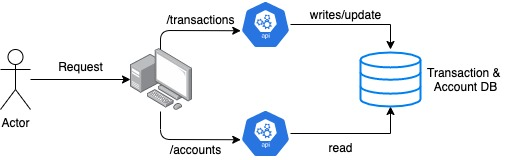
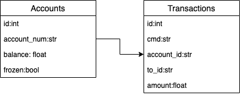

# Mini Bank Challenge

This take-home challenge simulates transaction requests to an API (the one I am creating) with the intention to store/save money information. The 2 APIs that will be accessible through REST are `transactions` and `accounts`.

Transactions offer the ability to make changes to an account id. For this simulation, we will assume that the accounts not in the db exist, but are totaled to 0 balance (we will write it in if it doesn't exist). Transactions that are successful will be logged and unsuccessful transactions will be part of the response object to the client.

Accounts provide information about the account id (mostly about balance and if the account is able to take transactions). The parameters passed can be multiple account ids, and for each one, we should return its current information.

## Design

From the diagram above we see that a request will be handled by either transactions or accounts endpoints. It is intuitive to think that the transactions will cause more writes into the db due to the nature of the request (deposit, transfer, freeze, unfreeze, etc). Meanwhile, the accounts endpoint is more about the reading capabilities. We request information about the account.

The database will only be composed of 2 tables, transactions and accounts. Transactions will have a unique universal id generation at the moment the request enters our application to keep historic data. There will be a foreign key to the account id so we can associate the transactions later. For transfer, we will use the from_id parameter as the account id since it might be more useful to know why we are losing money, instead of why we are gaining it :). In accounts table, we will store the information for the account such as balance and whether the account is froze or not.

#### Transaction Id
It was briefly mentioned above that we are generating a transaction id when we get the json list of requests for each of the transactions. I am using the uuid library in python and the `uuid4()` function that generates the id based on random numbers. The first option was to use `uuid1()`, but it uses mac address and could be a potential issue for privacy. Not so much for this challenge since it will be run locally, but still something to think about.

## Testing
Tests using pytest and pytest-flask. In order to execute them, run the command: `pytest`

## Execution
I am pretty new to building the docker container files. So I decided to explore this alternative and learn something new.

One challenge I faced with containerization was the inability to use local host once the application is in the container. Because of it, I decided to follow the suggestion in this blog, https://pythonspeed.com/articles/docker-connection-refused/, to have the application open too all interfaces. For the app, it means that instead of hitting on host 127.0.0.1, we go to 0.0.0.0

#### Building Docker Image
To build the image, run the following command:
`docker image build -t docker-minibank .`

#### Running Docker Image
To run the image:
`docker run -p 5000:5000 -d docker-minibank`

I use the macOS dashboard, so I can see the container I have running. Since this is not running locally, that means we can use docker's dashboard's terminal to check the logs printed to stdout.

#### Alternative (Running Locally)
Alternatively, when docker is not available, I started using my terminal as the localhost. I had some issues (maybe conflicts?) running flask and marshmallow together. So, for simplicity and to avoid getting into rabbit hole (I can do that later when this is over), I opted for using the python execution.
Run the following command to run the flask app:
1. on the root folder: `source /venv/bin/activate` to start the virtual environment
1. `pip install -r requirements.txt` to install dependencies
1. `python3 app.py` to run application locally

#### Accessing the Host
To be able to fit the docker image, I had to change the host from local to all interfaces. To access the app:
`http://0.0.0.0:5000`

##Resources
1. https://blog.miguelgrinberg.com/post/the-flask-mega-tutorial-part-iv-database
1. https://flask-sqlalchemy.palletsprojects.com/en/2.x/queries/#querying-records
1. https://flask-marshmallow.readthedocs.io/en/latest/
1. https://pytest-flask.readthedocs.io/en/latest/
1. https://www.docker.com/get-started
